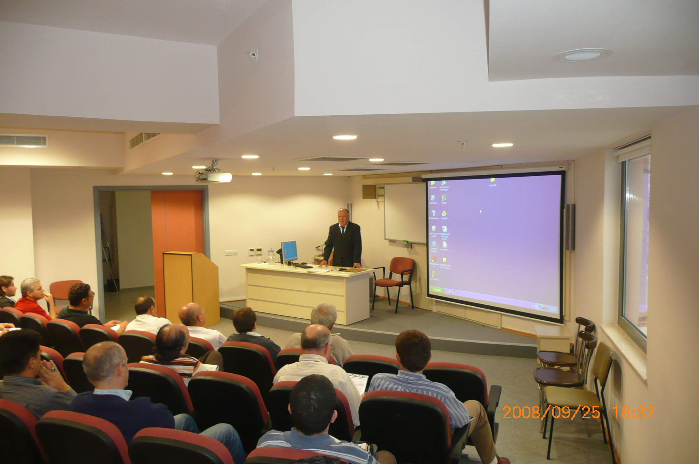

# TÜNEL YAPIMI EL KİTABI
## İçerik
Bu kitap Tünel Şantiye Mühendisinin El Kitabı olması amacı ile yazılmıştır. Tünel İnşaatlarında yapım yöntemlerini anlatmaktadır. Kitap taslak halindedir. Son düzenlemeler ve Türkçe düzeltmeleri yapılmamıştır.

## Kullanım
Referans gösterilerek buradaki bilgiler serbestçe kullanılabilir. 

## Yazar
Kitap İnşaat Mühendisi [Hasan AYDIN](https://www.linkedin.com/in/hasan-aydin-b5bab742/) tarafından yazılmıştır.  

## Sunum
**sunum** klasörü altında yazarın 25.09.2008 tarihinde İzmir İnşaat Mühendisleri Odası'nda gerçekleştirdiği 
***İzmir Hafif Raylı Sistemi 2. Aşama İkmal Hattı (ÜÇYOL–FAHRETTİN ALTAY MEYDANI ARASI) Zemin Durumu, İnşaat Güçlükleri ve Tünel Açma Yöntemleri*** konulu sunumu da mevcuttur.   

